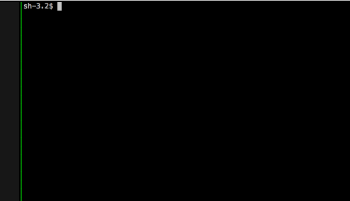

[](http://badge.fury.io/rb/minder)



## What is it?

This is a CLI-based tool that combines the best of several different
productivity methodologies.

At present it has these features:

- A timer to help with keeping to the [Pomodoro
  Technique](http://pomodorotechnique.com/) rhythm of 4 25 minute work periods
  with five minute breaks, followed by a long 15 minute break. You hear the
  soothing sounds of a "pomodoro" kitchen timer at the beginning and end of a
  break.
- A todo log that allows starting, unstarting and completing a task.
- Ability to filter tasks by a string (useful for focusing on [Getting Things
  Done](http://gettingthingsdone.com/)-style labels like @context and +project.
- Ability to jump through tasks using a Vim-like search.

Plans for the future include:

- Integration with a website blacklist tool like
  [SelfControl](https://github.com/SelfControlApp/selfcontrol/).
- Keeping track of the number of pomodoros performed during a day.
- Desktop notifications for Linux and MacOS
- Prompts to summarize plans for the day and day's end progress, inspired by
  [Day One](http://dayoneapp.com/).

Audio files are from https://github.com/niftylettuce/pomodoro-timer

## Installation

You must have a version of Ruby that is 2.0 or higher and SQLite3.

Install with

``` bash
gem install minder
```

## Usage

### Command line
Start the program by running `minder`

### Interface

Minder is designed to be run in a separate pane in a Tmux session (or in
a split inside a program like iTerm2). The tasks list will scroll if there is
not enough room to display all tasks.

The interface is organized into frames. You can switch between frames by
pressing Tab. The commands for each frame only work when the frame is focused.

- The Pomodoro timer frame. Press space to begin the next period.
- The Tasks frame. This frame minimizes during a Pomodoro period to avoid
  distraction. The commands for interacting with the message frame are based on
  Vim keystrokes:
  - `/` to open a dialog to search within the list of tasks.
  - `d` to mark a task as done.
  - `e` to edit a task.
  - `f` to open a dialog to filter the list of tasks.
  - `gg` to go to top of task list and `G` to go to bottom of list.
  - `j` to do down the list and `k` to go up.
  - `m` to minimize the tasks frame.
  - `n` to go to next search result and `N` to go to previous search result.
  - `s` to start a task.
  - `u` to un-start a task. 
  - `x` to delete a task.
- The Quick Add Task frame. Enter text here to add a task to the tasks list at
  any time.

### Data

The tasks are stored in an sqlite3 file that by default is located at
`~/.minder/database.sqlite3`. 

Minder also generates a couple text files as a form of backup in case the
sqlite file gets corrupted: `~/.minder/doing.txt` and `~/.minder/done.txt`

## Design notes

This program is intentionally idiosyncratic. It is designed for a particular
workflow and set of use cases that make sense to me. Specifically it is
designed for someone who works in a maximized terminal all day, using Vim
keybindings for both text editing and for moving between Vim splits and Tmux
panes (using the excellent
[vim-tmux-navigator](https://github.com/christoomey/vim-tmux-navigator)). The
main goal is to avoid switching to a GUI program or opening a website in order
to add a task or see the Pomodoro status.

If you do find this program useful feel free to make feature requests or better
yet open pull requests.

## Development

### Ubuntu

- Install the SQLite3 library:

```bash
sudo apt-get install libsqlite3-dev
```

## License

MIT License, see LICENSE.txt
